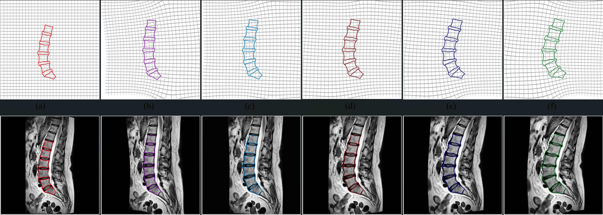

# SSMSpine
**SSMSpine** dataset comprises a total of **12,500** synthetic yet realistic mid-sagittal lumbar spine MR images. Each MRI is annotated with the identification of five lumbar discs **(D1, D2, D3, D4, D5)** and six vertebral bones **(L1, L2, L3, L4, L5, S1)**.SSMSpine provides not just annotated segmentation masks but also includes landmark coordinates, offering valuable information for diverse medical image analysis tasks.

Image size is **512 × 512**, and the intensity of each image is normalized to fall within the range **[0,1]**. The dataset also include **intensity corrected image**, **intensity equalized image**, **pixel label map**, **binary masks**, **landmark points coordinates** for each subject in images. There are **236** shape landmark points for each vertebra bone, and **176** shape landmark points for each lumbar disc.

The SSMSpine dataset is synthesized using a combination of a statistical shape model (SSM) and biomechanics, which serves as a special way of de-identifying patient image data. For details of the generation process, please refer to our paper ***[SymTC: A symbiotic Transformer-CNN net for instance segmentation of lumbar spine MRI](https://doi.org/10.1016/j.compbiomed.2024.108795)***.

Kindly be aware that the SSMSpine dataset is exclusively intended for research purposes.

## Download Dataset

You can use direct links to download  [SSMSpine Dataset](https://drive.google.com/drive/folders/17QXBCrfcQB6Gc4ITZBAURHoD60AMEQBB?usp=drive_link).


| Name  | Content | Patient Texture | Virtual Shape | Virtual Patients | Size | Link |
| :---: | :---: | :---: | :---: | :---: |:---: | :---: |
| `SSMSpine_Train.zip`  | Train Set| 80 | 125 |10,000| 20.23GB | [Download](https://drive.google.com/file/d/1WkiMCZC5gz_zKf5cXHVwUw5uJCcFIRrM/view?usp=sharing)|
| `SSMSpine_Test.zip`  | Test Set| 20 | 125 | 2,500 | 5.19GB | [Download](https://drive.google.com/file/d/17Xp3fEIKo9h1VNMkEXzG5SWIRB8uol02/view?usp=sharing)|
| `SSMSpine_Train_Sample.zip` | Train Set Samples | 1 | 125 | 125| 205.6MB | [Download](https://drive.google.com/file/d/1D2_j9wm7_E-SBQ53E6sIDi-q3gQZlB39/view?usp=drive_link)|
| `SSMSpine_Test_Sample.zip`  | Test Set Samples | 1 | 125 | 125| 261.7MB | [Download](https://drive.google.com/file/d/1K7WtxCH3tvAanIRXVlReerrigM1iu21k/view?usp=drive_link)|

## Data Description

The data is organized as a dictionary. The following provides the data details.

| Key | Dimension | Description |
| :---: |:---:| :---: |
| img | (512, 512)| Raw Image |
| img_corrected |(512, 512)|Intensity Corrected Image |
| img_equalized |(512, 512)|Intensity Equalized Image |
| label | (1, 512, 512) | Label Map |
| mask | (11, 512, 512) | Binary Label Masks (Bone/Disc) |
| shape | (1696, 2) | Shape Coordinates (All Landmark Points) |
| bone | (6, 236, 2) | Shape Coordinates (Bone Landmark Points) |
| bone_mask |(6, 512, 512)| Binary Label Masks (Bone) |
| disk |(5, 176 ,2)| Shape Coordinates (Disc Landmark Points) |
| disk_mask |(5, 512, 512)| Binary Label Masks (Disc) |


### Labels
The description of image pixel labels is as follows:

| Label | Description |
| :---: | :---: |
| 0 | Background |
| 1 | Lumbar Vertebrae 1 (L1) |
| 2 | Lumbar Vertebrae 2 (L2) |
| 3 | Lumbar Vertebrae 3 (L3) |
| 4 | Lumbar Vertebrae 4 (L4) |
| 5 | Lumbar Vertebrae 5 (L5) |
| 6 | Sacral Vertebrae S1 |
| 7 | Discs between L1/L2 (D1) |
| 8 | Discs between L2/L3 (D2) |
| 9 | Discs between L3/L4 (D3) |
| 10 | Discs between L4/L5 (D4) |
| 11 | Discs between L5/S1 (D5) |


## Usage
Install [PyTorch](https://pytorch.org/) and Load data with [torch.load( )](https://pytorch.org/docs/stable/generated/torch.load.html)

## Sample Visualization



## CONTACT

To access the complete SSMSpine dataset, which is password-protected, kindly send an email to the jiasong.chen@miami.edu for further assistance. 

For further details regarding the project, please contact the corresponding author [Liang Liang](https://liangbright.wordpress.com/).


## CITATION

```latex
@article{chen2024symtc,
  title={SymTC: A symbiotic Transformer-CNN net for instance segmentation of lumbar spine MRI},
  author={Chen, Jiasong and Qian, Linchen and Ma, Linhai and Urakov, Timur and Gu, Weiyong and Liang, Liang},
  journal={Computers in biology and medicine},
  volume={179},
  pages={108795},
  year={2024},
  publisher={Elsevier}
}
```
